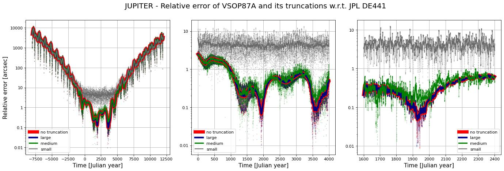
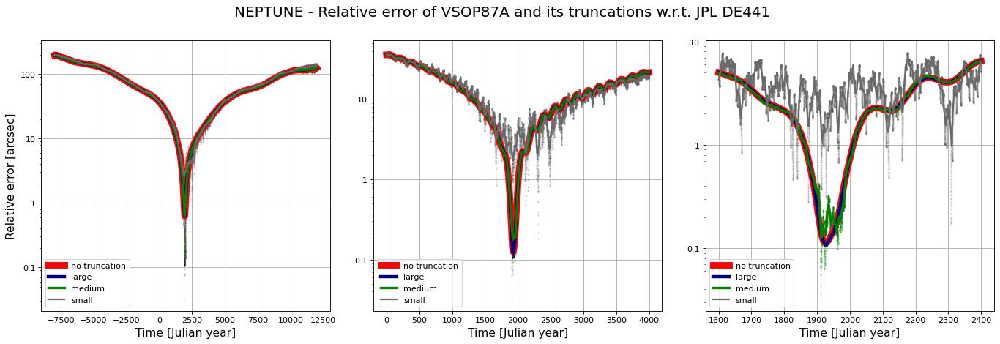

# Truncated VSOP87A and ELP/MPP02 Ephemerides in JSON

## Overview

This repository provides a simple way to compute planetary and lunar ephemerides with medium accuracy using truncated VSOP87A [^vsop87][^vsop87_files] and ELP/MPP02 [^mpp02][^mpp02_files] series. These closed formula models bridge the gap between simple approximations[^approx][^miller2] and high-precision JPL DE ephemerides[^jpl_de441] by offering arcsecond-level accuracy without the need to handle large datasets.  

The series are preprocessed into compact JSON files with varying levels of truncation. Python and JavaScript code is provided to compute positions and velocities directly from them. 

## Using the JSON files

Once loaded, the JSON data can be used to compute positions and velocities with straightforward code. Python and JavaScript implementations doing this are
- [vsop87a_ephemeris.py](vsop87a_ephemeris.py)
- [mpp02_ephemeris.py](mpp02_ephemeris.py)
- [vsop87aEphemeris.js](javascript/vsop87aEphemeris.js)
- [mpp02Ephemeris.js](javascript/mpp02Ephemeris.js).

## Conversion to JSON format

Before truncation "raw" JSON files
- [vsop87a_raw.json](./json/vsop87a_raw.json)
- [mpp02_llr_raw.json](./json/mpp02_llr_raw.json)
- [mpp02_405_raw.json](./json/mpp02_405_raw.json)

containing the whole series are created in [vsop87a_converter.py](vsop87a_converter.py) and [mpp02_converter.py](mpp02_converter.py). Only selected coefficients are retained. 

For VSOP87A, the coefficients are adjusted to use time in centuries instead of millennia since J2000.0. Additionally, the EARTH series is omitted because the dataset already includes the Earth-Moon barycenter EARTH-MOON, which can be combined with the high-accuracy vector $p_{\rm MOON} - p_{\rm EARTH}$ from MPP02 to compute more precise positions for both the Moon and Earth relative to the Sun.  

For MPP02, two versions exist—one fitted to DE405 and another to LLR data. For truncation, we use the series fitted to LLR data.

## Truncation of the series

Truncation is done in [vsop87a_truncate.py](vsop87a_truncate.py) and [mpp02_truncate.py](mpp02_truncate.py) starting with the coefficients from the raw series. Last digit in a coefficient is truncated if
```math
\frac{\text{error caused by truncation}}{\text{\#characters removed with truncation}}
< C
``` 
for a given constant threshold $C>0$. This process is repeated until no last digit in any coefficient satisfies the condition. The the same condition is used to determine whether we drop the series term completely. In the code, compact form of rounding to significant digits is used instead of plain truncation of last digit but the idea stays the same. The error in the nominator is defined to be the maximum positional error over the time period $[-T_{\text{MAX}},T_{\text{MAX}}]$, where $T_{\text{MAX}}>0$ is a constant. An upper bound for the error is used in the code to estimate it.

For both VSOP87A and MPP02 parameters $C$ and $T_{\text{MAX}}$ are used to create "small", "medium", and "large" sized truncated JSON files stored in [./json](./json/) directory along with the raw series. The parameters are selected for each planet to tune the result.

The large variants retain nearly the same accuracy as the original series (see [below](#accuracy)) while taking much less space. The medium variants are practical compromises between accuracy and file size. Small variants are also included but are likely outperformed in practice by concise low-accuracy algorithms such as the one for position of the Moon in Meeus' Astronomical Algorithms [^meeus1][^miller1].

The truncated files can be file compressed to save even more space. Below are file sizes before and after ZIP-compression. Compressed files are not provided in this package.

|JSON File|Size (KB)|Compressed size (KB)|
|:---:|:---:|:---:|
|[VSOP87A small](./json/vsop87a_truncated_small.json)|27|9|
|[VSOP87A medium](./json/vsop87a_truncated_medium.json)|122|41|
|[VSOP87A large](./json/vsop87a_truncated_large.json)|433|147|
|[MPP02 small](./json/mpp02_llr_truncated_small.json)|9|4|
|[MPP02 medium](./json/mpp02_llr_truncated_medium.json)|35|13|
|[MPP02 large](./json/mpp02_llr_truncated_large.json)|211|76|

(Table might not be up to date.)

<a id="accuracy"></a>

## Accuracy of the raw and truncated series

We measure the accuracy of the raw and truncated series with respect to JPL DE441[^jpl_de441]. The errors are plotted in [plot_errors.py](plot_errors.py) and the results are displayed below. The continuous curves in the plots are moving averages of the errors, not direct error measurements. The y-axis in the plots represents the relative error with respect to the Sun, given by 
```math
\frac{|p(t)-p_{\rm DE441}(t)|}{|p_{\rm DE441}(t)|}.
```
For convenience, the error is reported in dimensionless arcseconds, with $1''=\pi/180/3600$. In the tangential case it approximates angular separation in arcseconds.

<details open>
<summary>The Moon</summary>


</details>
<details>

<summary>Mercury</summary>


</details>

<details>
<summary>Venus</summary>


</details>

<details>
<summary>Earth-Moon barycenter</summary>


</details>

<details>
<summary>Mars</summary>


</details>

<details>
<summary>Jupiter</summary>


</details>

<details>
<summary>Saturn</summary>


</details>

<details>
<summary>Uranus</summary>


</details>

<details>
<summary>Neptune</summary>


</details>

## References

[^vsop87]: Bretagnon, P. and Francou, G., “Planetary Theories in rectangular and spherical variables: VSOP87 solution.”, *Astronomy and Astrophysics*, vol. 202, p. 309, 1988. [Bibcode: 1988A&A...202..309B](https://ui.adsabs.harvard.edu/abs/1988A%26A...202..309B).

[^vsop87_files]: VSOP87 files https://ftp.imcce.fr/pub/ephem/planets/vsop87

[^mpp02]: Chapront, J. and Francou, G., “The lunar theory ELP revisited.  Introduction of new planetary perturbations”, *Astronomy and Astrophysics*, vol. 404, pp. 735–742, 2003. [DOI: 10.1051/0004-6361:20030529](https://doi.org/10.1051/0004-6361:20030529).

[^mpp02_files]: ELP/MPP02 files ftp://cyrano-se.obspm.fr/pub/2_lunar_solutions/2_elpmpp02

[^meeus1]: Jean H. Meeus. 1991. Astronomical Algorithms. Willmann-Bell, Incorporated.

[^miller1]: Truncated version of ELP 2000/82 from Meeus' Alstronomical Algorithms implemented by Greg Miller https://www.celestialprogramming.com/meeus-elp82.html

[^miller2]: Celestial Programming: Low Precision Moon Position, Greg Miller, https://www.celestialprogramming.com/lowprecisionmoonposition.html

[^jpl_de441]: Park, R. S., Folkner, W. M., Williams, J. G., and Boggs, D. H., “The JPL Planetary and Lunar Ephemerides DE440 and DE441”, <i>The Astronomical Journal</i>, vol. 161, no. 3, Art. no. 105, IOP, 2021. [doi:10.3847/1538-3881/abd414](https://doi.org/10.3847/1538-3881/abd414).

[^approx]: Approximate Positions of the Planets https://ssd.jpl.nasa.gov/planets/approx_pos.html