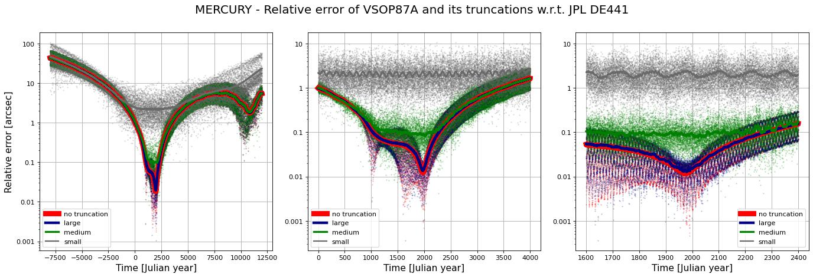
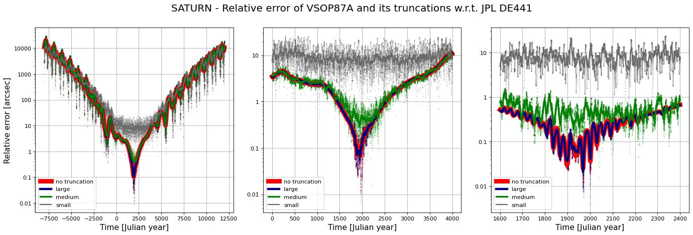

# VSOP87 and ELP/MPP02 ephemeris with Python and JavaScript

<!-- [^vsop87] [^mpp02] -->

## Accuracy of the series

We measure the accuracy of the raw and truncated series against [JPL DE441](https://ssd.jpl.nasa.gov/doc/de440_de441.html).

The Moon

Mercury

Venus

Mars

Earth-Moon barycenter

Jupiter

Saturn

Uranus

Neptune

## Refereces

[^vsop87]: Bretagnon, P. and Francou, G., “Planetary Theories in rectangular and spherical variables: VSOP87 solution.”, *Astronomy and Astrophysics*, vol. 202, p. 309, 1988. [Bibcode: 1988A&A...202..309B](https://ui.adsabs.harvard.edu/abs/1988A%26A...202..309B).

[^mpp02]: Chapront, J. and Francou, G., “The lunar theory ELP revisited.  Introduction of new planetary perturbations”, *Astronomy and Astrophysics*, vol. 404, pp. 735–742, 2003. [DOI: 10.1051/0004-6361:20030529](https://doi.org/10.1051/0004-6361:20030529).