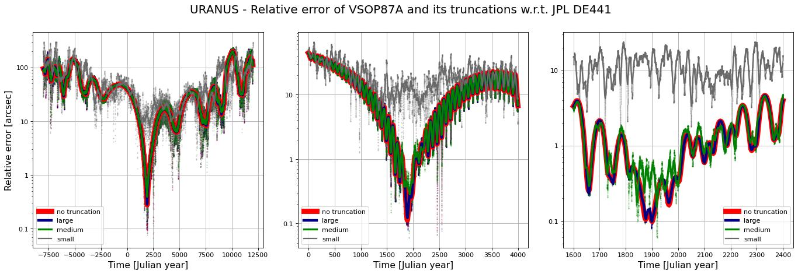

# Storing VSOP87A and ELP/MPP02 series in JSON format

## Overview

This repository provides tools to convert, truncate, and compute planetary and lunar ephemerides based on VSOP87(A) [^vsop87][^vsop87_files] and ELP/MPP02[^mpp02][^mpp02_files] series. The data is stored in compact JSON files that can be read and used easily.

## Using the JSON files

After reading the content of one of the JSON files, it can be used to compute positions and velocities with simple code. Python and JavaScript implementations doing this are
- [vsop87a_ephemeris.py](vsop87a_ephemeris.py)
- [mpp02_ephemeris.py](mpp02_ephemeris.py)
- [vsop87aEphemeris.js](javascript/vsop87aEphemeris.js)
- [mpp02Ephemeris.js](javascript/mpp02Ephemeris.js).

## Conversion to JSON format

Before truncation "raw" JSON files
- [vsop87a_raw.json](./json/vsop87a_raw.json)
- [mpp02_llr_raw.json](./json/mpp02_llr_raw.json)
- [mpp02_405_raw.json](./json/mpp02_405_raw.json)

containing the whole series are created in [vsop87a_converter.py](vsop87a_converter.py) and [mpp02_converter.py](mpp02_converter.py). Only selected coefficients are stored. In case of VSOP87A coefficients are modified to use time as centuries instead of millenia since J2000.0. For MPP02 either of the series fitted to DE405 and LLR could be used but for truncation we have chosen to stick to LLR fitted series.

## Truncation of the series

Truncation is done in [vsop87a_truncate.py](vsop87a_truncate.py) and [mpp02_truncate.py](mpp02_truncate.py) by starting with the raw coefficients and considering the last digit in each coefficient. The last digit is truncated if
```math
\frac{\text{error caused by truncation}}{\text{characters saved by truncation}}
< T
``` 
for a given constant threshold $T>0$. After repeated truncation of all last digits satisfying the condition, the same condition is used to determine whether we drop the series term completely. In the code, compact form of rounding to significant digits is used instead of plain truncation of last digit but the idea stays the same. The error in the nominator is defined to be the maximum positional error over the time period $[-T_{\text{MAX}},T_{\text{MAX}}]$, where $T_{\text{MAX}}>0$ is a constant. An upper bound for the error is used in the code to estimate it.

For both VSOP87A and MPP02 three thresholds $T$ and $T_{\text{MAX}}$ are used to create "small", "medium", and "large" sized truncated JSON files stored in [./json](./json/) directory along with the raw series. The parameters are selected for each planets to tune the result.

The large variants basically have the same accurate as the original series (see [below](#accuracy)), but take much less space. The medium variants are practical compromises between accuracy and file size. Small variants are also included but might be practically outperformed by algorithms such as the one for position of the Moon in Meeus' Astronomical Algorithms [^meeus1][^miller1].

The truncated files can be file compressed to save even more space. Below are file sizes before and after typical compression. Compressed files are not provided in this package.

|JSON File|Size (KB)|Compressed size (KB)|
|:---:|:---:|:---:|
|VSOP87A small|27|9|
|VSOP87A medium|122|41|
|VSOP87A large|433|147|
|MPP02 small|9|4|
|MPP02 medium|35|13|
|MPP02 large|211|76|

(Table might not be up to date.)

<a id="accuracy"></a>

## Accuracy of the raw and truncated series

We measure the accuracy of the raw and truncated series with respect to JPL DE441[^jpl_de441]. The errors are plotted in [plot_errors.py](plot_errors.py) and the results are displayed below. The continuous curves in the plots are moving averages of the errors, not direct error measurements. The y-axis in the plots represents the relative error with respect to the Sun, given by 
```math
\frac{|p(t)-p_{\rm DE441}(t)|}{|p_{\rm DE441}(t)|}.
```
For convenience, the error is reported in dimensionless arcseconds, with $1''=\pi/180/3600$. In the tangential case it approximates angular separation in arcseconds.

<details open>
<summary>The Moon</summary>


</details>
<details>

<summary>Mercury</summary>


</details>

<details>
<summary>Venus</summary>


</details>

<details>
<summary>Earth-Moon barycenter</summary>


</details>

<details>
<summary>Mars</summary>


</details>

<details>
<summary>Jupiter</summary>


</details>

<details>
<summary>Saturn</summary>


</details>

<details>
<summary>Uranus</summary>


</details>

<details>
<summary>Neptune</summary>


</details>

## References

[^vsop87]: Bretagnon, P. and Francou, G., “Planetary Theories in rectangular and spherical variables: VSOP87 solution.”, *Astronomy and Astrophysics*, vol. 202, p. 309, 1988. [Bibcode: 1988A&A...202..309B](https://ui.adsabs.harvard.edu/abs/1988A%26A...202..309B).

[^vsop87_files]: VSOP87 files https://ftp.imcce.fr/pub/ephem/planets/vsop87

[^mpp02]: Chapront, J. and Francou, G., “The lunar theory ELP revisited.  Introduction of new planetary perturbations”, *Astronomy and Astrophysics*, vol. 404, pp. 735–742, 2003. [DOI: 10.1051/0004-6361:20030529](https://doi.org/10.1051/0004-6361:20030529).

[^mpp02_files]: ELP/MPP02 files ftp://cyrano-se.obspm.fr/pub/2_lunar_solutions/2_elpmpp02

[^meeus1]: Jean H. Meeus. 1991. Astronomical Algorithms. Willmann-Bell, Incorporated.

[^miller1]: Truncated version of ELP 2000/82 from Meeus' Alstronomical Algorithms implemented by Greg Miller https://www.celestialprogramming.com/meeus-elp82.html

[^jpl_de441]: Park, R. S., Folkner, W. M., Williams, J. G., and Boggs, D. H., “The JPL Planetary and Lunar Ephemerides DE440 and DE441”, <i>The Astronomical Journal</i>, vol. 161, no. 3, Art. no. 105, IOP, 2021. [doi:10.3847/1538-3881/abd414](https://doi.org/10.3847/1538-3881/abd414).